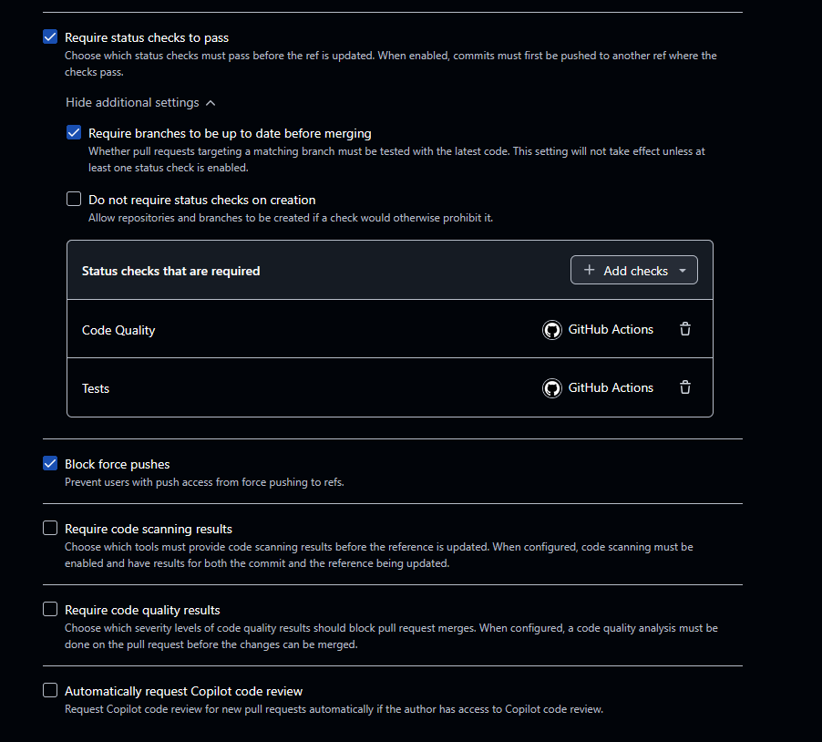
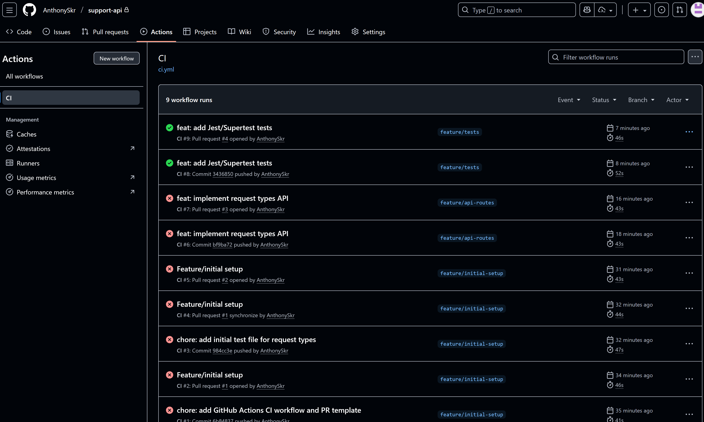
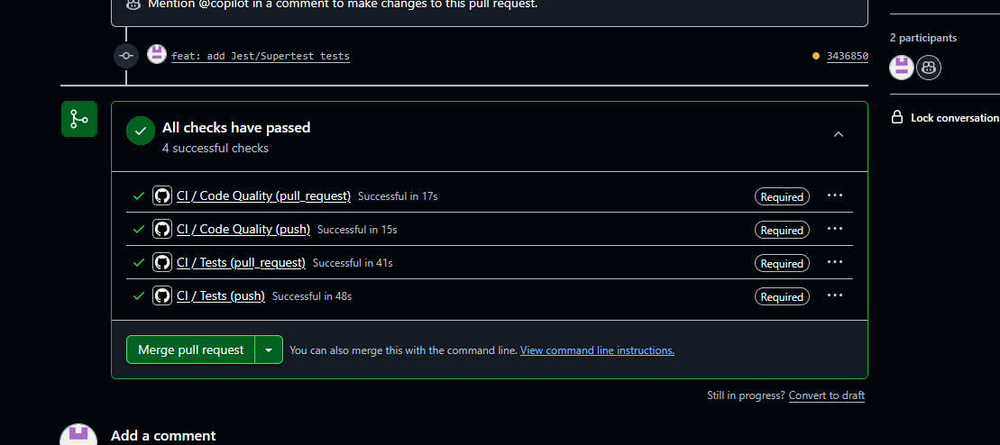

# support-api

## Workflow Git

- Branche `main` protégée
- Branches de fonctionnalité `feature/<nom>` pour tout développement
- Commits conventionnels : feat, fix, docs, style, refactor, test, chore
- PR obligatoire pour merger
- Checks obligatoires : `code-quality` et `tests`




## CI/CD

Jobs configurés :

- `code-quality` : ESLint + Prettier
- `tests` : Jest + Supertest avec seed MongoDB
- Coverage minimum : 70%

[](https://github.com/AnthonySkr/support-api/actions/workflows/ci.yml)



## Installation

Prérequis : Node.js, npm, MongoDB

```bash
git clone <URL_REPO>
cd support-api
npm install
```

### Commandes
```bash
npm run lint        # Vérifie le lint
npm run format      # Formate le code
npm run test        # Lance les tests avec coverage
node scripts/seed.js  # Initialise la BD
node src/server.js  # Démarre le serveur
```


---

## Structure

```
support-api/
├── src/              # Code source
│   ├── models/       # Modèles Mongoose
│   ├── routes/       # Routes Express
│   ├── config/       # Configs (ex: database.js)
│   └── server.js     # Serveur Express
├── tests/            # Tests Jest/Supertest
├── scripts/          # Scripts utilitaires (seed.js)
├── .github/          # Workflows GitHub Actions et PR template
├── eslint.config.js  # ESLint
├── .prettierrc       # Prettier
├── package.json      # Dépendances et scripts
└── README.md
```

